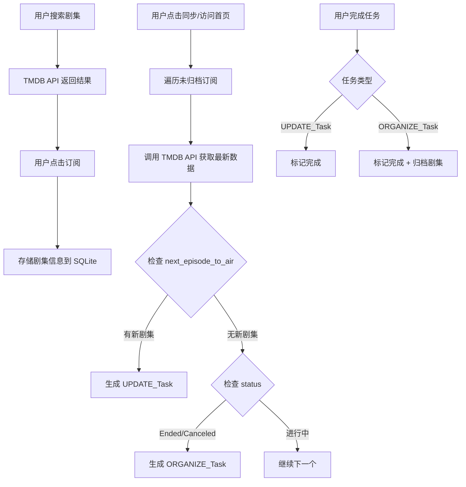
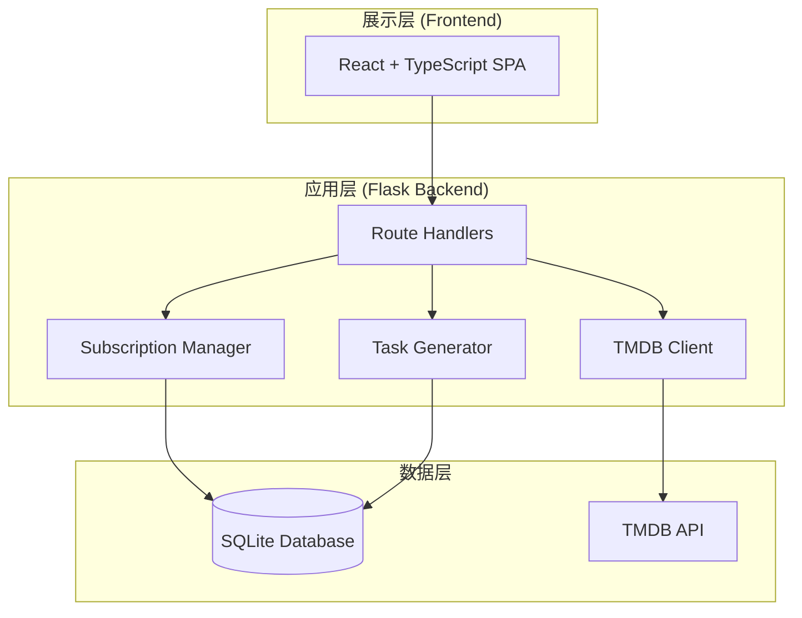

# Design Document: TV Tracker

## Overview

TV Tracker 是一个轻量级的 Web 应用，帮助用户追踪订阅剧集的更新状态，为 Emby 媒体库管理提供更新提醒。系统采用 Go 作为后端语言，使用 Gin 框架提供 REST API，SQLite 作为数据存储，前端使用 React + TypeScript。

### 核心工作流



## Architecture

系统采用经典的三层架构：



## Components and Interfaces

### 1. TMDB Client (`internal/tmdb/client.go`)

负责与 TMDB API 的所有交互。

```go
package tmdb

type Client struct {
    apiKey     string
    baseURL    string
    httpClient *http.Client
}

type SearchResult struct {
    ID           int      `json:"id"`
    Name         string   `json:"name"`
    PosterPath   string   `json:"poster_path"`
    FirstAirDate string   `json:"first_air_date"`
    OriginCountry []string `json:"origin_country"`
}

type TVDetails struct {
    ID              int          `json:"id"`
    Name            string       `json:"name"`
    Status          string       `json:"status"`
    PosterPath      string       `json:"poster_path"`
    OriginCountry   []string     `json:"origin_country"`
    NumberOfSeasons int          `json:"number_of_seasons"`
    NextEpisodeToAir *EpisodeInfo `json:"next_episode_to_air"`
    LastEpisodeToAir *EpisodeInfo `json:"last_episode_to_air"`
}

type EpisodeInfo struct {
    AirDate       string `json:"air_date"`
    EpisodeNumber int    `json:"episode_number"`
    SeasonNumber  int    `json:"season_number"`
    Name          string `json:"name"`
    Overview      string `json:"overview"`
}

type SeasonDetail struct {
    Episodes []EpisodeInfo `json:"episodes"`
}

func NewClient(apiKey string) *Client
func (c *Client) SearchTV(query string) ([]SearchResult, error)
func (c *Client) GetTVDetails(tmdbID int) (*TVDetails, error)
func (c *Client) GetSeasonEpisodes(tmdbID, seasonNumber int) ([]EpisodeInfo, error)
```

### 2. Models (`internal/models/models.go`)

数据模型定义。

```go
package models

type TaskType string

const (
    TaskTypeUpdate   TaskType = "UPDATE"
    TaskTypeOrganize TaskType = "ORGANIZE"
)

type TVShow struct {
    ID            int64     `json:"id"`
    TMDBID        int       `json:"tmdb_id"`
    Name          string    `json:"name"`
    TotalSeasons  int       `json:"total_seasons"`
    Status        string    `json:"status"`         // Returning Series, Ended, Canceled
    OriginCountry string    `json:"origin_country"`
    ResourceTime  string    `json:"resource_time"`  // 资源预计可用时间
    IsArchived    bool      `json:"is_archived"`
    CreatedAt     time.Time `json:"created_at"`
    UpdatedAt     time.Time `json:"updated_at"`
}

type Episode struct {
    ID        int64  `json:"id"`
    TMDBID    int    `json:"tmdb_id"`
    Season    int    `json:"season"`
    Episode   int    `json:"episode"`
    Title     string `json:"title"`
    Overview  string `json:"overview"`
    AirDate   string `json:"air_date"`  // YYYY-MM-DD 格式
}

type Task struct {
    ID           int64     `json:"id"`
    TVShowID     int64     `json:"tv_show_id"`
    TVShowName   string    `json:"tv_show_name"`   // 用于展示
    ResourceTime string    `json:"resource_time"`  // 资源预计可用时间
    TaskType     TaskType  `json:"task_type"`
    Description  string    `json:"description"`
    IsCompleted  bool      `json:"is_completed"`
    CreatedAt    time.Time `json:"created_at"`
}
```

### 3. Database Repository (`internal/repository/repository.go`)

数据访问层，封装所有数据库操作。

```go
package repository

type TVShowRepository interface {
    Create(show *models.TVShow) error
    GetByTMDBID(tmdbID int) (*models.TVShow, error)
    GetAllActive() ([]models.TVShow, error)
    GetAll() ([]models.TVShow, error)
    Update(show *models.TVShow) error
    Archive(showID int64) error
}

type EpisodeRepository interface {
    Upsert(episode *models.Episode) error
    GetByTMDBID(tmdbID int) ([]models.Episode, error)
    GetByAirDate(date string) ([]models.Episode, error)  // 获取指定日期的所有剧集
    DeleteByTMDBID(tmdbID int) error
}

type TaskRepository interface {
    Create(task *models.Task) error
    GetPendingByType(taskType models.TaskType) ([]models.Task, error)
    GetByShowAndEpisode(showID int64, episode string) (*models.Task, error)
    ExistsOrganizeTask(showID int64) (bool, error)
    Complete(taskID int64) error
    GetAllPending() ([]models.Task, error)
    GetByID(taskID int64) (*models.Task, error)
}
```

### 4. Subscription Manager (`internal/service/subscription.go`)

管理订阅逻辑。

```go
package service

type SubscriptionManager struct {
    tmdb     *tmdb.Client
    showRepo repository.TVShowRepository
}

func NewSubscriptionManager(tmdb *tmdb.Client, showRepo repository.TVShowRepository) *SubscriptionManager

func (s *SubscriptionManager) Subscribe(tmdbID int) (*models.TVShow, error)
func (s *SubscriptionManager) IsSubscribed(tmdbID int) bool
func (s *SubscriptionManager) GetAllSubscriptions() ([]models.TVShow, error)
func (s *SubscriptionManager) Unsubscribe(showID int64) error
```

### 5. Task Generator (`internal/service/task_generator.go`)

核心同步逻辑。

```go
package service

type SyncResult struct {
    UpdateTasks   int `json:"update_tasks"`
    OrganizeTasks int `json:"organize_tasks"`
    Errors        int `json:"errors"`
}

type TaskGenerator struct {
    tmdb     *tmdb.Client
    showRepo repository.TVShowRepository
    taskRepo repository.TaskRepository
}

func NewTaskGenerator(tmdb *tmdb.Client, showRepo repository.TVShowRepository, taskRepo repository.TaskRepository) *TaskGenerator

func (t *TaskGenerator) SyncAll() (*SyncResult, error)
func (t *TaskGenerator) checkEpisodeUpdate(show *models.TVShow, tmdbData *tmdb.TVDetails) (*models.Task, error)
func (t *TaskGenerator) checkShowEnded(show *models.TVShow, tmdbData *tmdb.TVDetails) (*models.Task, error)
func FormatEpisodeID(season, episode int) string  // 格式化为 S01E05
```

### 6. Task Board Service (`internal/service/task_board.go`)

任务看板服务。

```go
package service

type DashboardData struct {
    UpdateTasks   []models.Task `json:"update_tasks"`
    OrganizeTasks []models.Task `json:"organize_tasks"`
}

type TaskBoardService struct {
    taskRepo repository.TaskRepository
    showRepo repository.TVShowRepository
}

func NewTaskBoardService(taskRepo repository.TaskRepository, showRepo repository.TVShowRepository) *TaskBoardService

func (t *TaskBoardService) GetDashboardData() (*DashboardData, error)
func (t *TaskBoardService) CompleteTask(taskID int64) error
```

### 7. Telegram Notifier (`internal/notify/telegram.go`)

Telegram 通知服务。

```go
package notify

type TelegramNotifier struct {
    botToken string
    chatID   string
    client   *http.Client
}

func NewTelegramNotifier(botToken, chatID string) *TelegramNotifier

func (n *TelegramNotifier) SendMessage(text string) error
func (n *TelegramNotifier) SendDailyReport(tasks []models.Task) error
```

### 8. Resource Time Calculator (`internal/service/resource_time.go`)

资源时间推断逻辑。

```go
package service

// InferResourceTime 根据国家/地区推断资源可用时间
// US/UK/CA -> "18:00"
// CN/TW -> "20:00"  
// JP/KR -> "23:00"
// 其他 -> "待定"
func InferResourceTime(originCountry string) string

## Data Models

### Database Schema

```sql
-- 订阅的剧集
CREATE TABLE tv_shows (
    id INTEGER PRIMARY KEY AUTOINCREMENT,
    tmdb_id INTEGER UNIQUE NOT NULL,
    name TEXT NOT NULL,
    total_seasons INTEGER DEFAULT 1,
    status TEXT DEFAULT 'Unknown',        -- Returning Series, Ended, Canceled
    origin_country TEXT DEFAULT '',
    resource_time TEXT DEFAULT '待定',     -- 资源预计可用时间
    is_archived BOOLEAN DEFAULT FALSE,
    created_at TIMESTAMP DEFAULT CURRENT_TIMESTAMP,
    updated_at TIMESTAMP DEFAULT CURRENT_TIMESTAMP
);

-- 缓存的剧集信息（从 TMDB 同步）
CREATE TABLE episodes (
    id INTEGER PRIMARY KEY AUTOINCREMENT,
    tmdb_id INTEGER NOT NULL,
    season INTEGER NOT NULL,
    episode INTEGER NOT NULL,
    title TEXT,
    overview TEXT,
    air_date DATE,
    UNIQUE(tmdb_id, season, episode),
    FOREIGN KEY (tmdb_id) REFERENCES tv_shows(tmdb_id)
);

-- 任务（更新提醒/整理归档）
CREATE TABLE tasks (
    id INTEGER PRIMARY KEY AUTOINCREMENT,
    tv_show_id INTEGER NOT NULL,
    task_type TEXT NOT NULL,  -- 'UPDATE' or 'ORGANIZE'
    description TEXT NOT NULL,
    is_completed BOOLEAN DEFAULT FALSE,
    created_at TIMESTAMP DEFAULT CURRENT_TIMESTAMP,
    FOREIGN KEY (tv_show_id) REFERENCES tv_shows(id)
);

CREATE INDEX idx_episodes_air_date ON episodes(air_date);
CREATE INDEX idx_episodes_tmdb ON episodes(tmdb_id);
CREATE INDEX idx_tasks_completed ON tasks(is_completed);
CREATE INDEX idx_shows_archived ON tv_shows(is_archived);
```

### TMDB API Response Structures

**Search Response** (`/search/tv`):
```json
{
  "results": [
    {
      "id": 1399,
      "name": "Game of Thrones",
      "poster_path": "/1XS1oqL89opfnbLl8WnZY1O1uJx.jpg",
      "first_air_date": "2011-04-17"
    }
  ]
}
```

**TV Details Response** (`/tv/{id}`):
```json
{
  "id": 1399,
  "name": "Game of Thrones",
  "status": "Ended",
  "poster_path": "/1XS1oqL89opfnbLl8WnZY1O1uJx.jpg",
  "origin_country": ["US"],
  "next_episode_to_air": {
    "air_date": "2024-01-15",
    "episode_number": 5,
    "season_number": 1
  }
}
```

## API Routes

| Route | Method | Description |
|-------|--------|-------------|
| `/` | GET | 任务看板首页 |
| `/search` | GET | 搜索页面 |
| `/api/search` | GET | 搜索 TMDB API |
| `/api/subscribe` | POST | 订阅剧集 |
| `/api/sync` | POST | 手动同步数据 |
| `/api/tasks/<id>/complete` | POST | 完成任务 |
| `/api/report` | POST | 发送 Telegram 日报 |
| `/library` | GET | 我的片库页面 |


## Correctness Properties

*A property is a characteristic or behavior that should hold true across all valid executions of a system—essentially, a formal statement about what the system should do. Properties serve as the bridge between human-readable specifications and machine-verifiable correctness guarantees.*

### Property 1: TMDB Search Returns Valid Results

*For any* non-empty search query, the TMDB_Client SHALL return a list (possibly empty) where each item contains id, name, poster_path, and first_air_date fields.

**Validates: Requirements 1.1, 1.2**

### Property 2: API Error Handling

*For any* TMDB API error response, the TMDB_Client SHALL return an error object with a descriptive message string, never raise an unhandled exception.

**Validates: Requirements 1.3**

### Property 3: Subscription Data Round-Trip

*For any* valid TMDB show ID, subscribing to the show and then retrieving it from the database SHALL return a TVShow with matching tmdb_id, name, status, and next_air_date.

**Validates: Requirements 2.2**

### Property 4: Subscription Idempotence

*For any* TMDB show ID, subscribing multiple times SHALL result in exactly one TVShow record in the database.

**Validates: Requirements 2.3**

### Property 5: Sync Processes Only Active Shows

*For any* set of TVShow records, the sync operation SHALL process only those where is_archived = False, and SHALL skip all archived shows.

**Validates: Requirements 3.1, 5.4, 6.3**

### Property 6: Sync Updates Local Data

*For any* non-archived TVShow, after sync completes, the local status and next_air_date SHALL match the values returned by TMDB API.

**Validates: Requirements 3.3**

### Property 7: Sync Resilience

*For any* set of subscriptions where some TMDB API calls fail, the sync operation SHALL continue processing remaining shows and return partial results.

**Validates: Requirements 3.4**

### Property 8: UPDATE_Task Generation for Due Episodes

*For any* TVShow where next_episode_to_air.air_date is today or in the past, and no UPDATE_Task exists for that episode, the Task_Generator SHALL create exactly one UPDATE_Task.

**Validates: Requirements 4.1, 4.4**

### Property 9: Episode ID Format

*For any* season number S and episode number E, the formatted episode ID SHALL be "S{SS}E{EE}" where SS and EE are zero-padded to 2 digits.

**Validates: Requirements 4.2**

### Property 10: UPDATE_Task Idempotence

*For any* TVShow and episode combination, running sync multiple times SHALL create at most one UPDATE_Task.

**Validates: Requirements 4.3**

### Property 11: ORGANIZE_Task Generation for Ended Shows

*For any* TVShow where status is "Ended" or "Canceled" and no ORGANIZE_Task exists, the Task_Generator SHALL create exactly one ORGANIZE_Task.

**Validates: Requirements 5.1**

### Property 12: ORGANIZE_Task Idempotence

*For any* ended/canceled TVShow, running sync multiple times SHALL create at most one ORGANIZE_Task.

**Validates: Requirements 5.3**

### Property 13: UPDATE_Task Completion

*For any* UPDATE_Task, marking it complete SHALL set is_completed to True and SHALL NOT modify the associated TVShow.is_archived.

**Validates: Requirements 6.1**

### Property 14: ORGANIZE_Task Completion Cascades to Archive

*For any* ORGANIZE_Task, marking it complete SHALL set is_completed to True AND set the associated TVShow.is_archived to True.

**Validates: Requirements 6.2**

### Property 15: Task Rendering Completeness

*For any* Task with an associated TVShow, the rendered task view SHALL include the show name and task description.

**Validates: Requirements 7.3**

### Property 16: TVShow Persistence Round-Trip

*For any* valid TVShow object, saving to the database and reading back SHALL produce an equivalent object.

**Validates: Requirements 8.1, 8.4**

### Property 17: Task Foreign Key Integrity

*For any* Task in the database, its tv_show_id SHALL reference an existing TVShow record.

**Validates: Requirements 8.2**

### Property 18: Resource Time Inference

*For any* origin country code, InferResourceTime SHALL return:
- "18:00" for US, UK, CA
- "20:00" for CN, TW
- "23:00" for JP, KR
- "待定" for all other countries

**Validates: Requirements 10.1, 10.2, 10.3, 10.4**

### Property 19: Daily Report Contains All Today's Episodes

*For any* set of episodes where air_date equals today, the daily report SHALL include all of them with show name, episode info, and resource time.

**Validates: Requirements 9.1, 9.2**

## Error Handling

### TMDB API Errors

| Error Type | Handling Strategy |
|------------|-------------------|
| Network timeout | Return error message, allow retry |
| 401 Unauthorized | Log error, prompt user to check API key |
| 404 Not Found | Return empty result for search, error for details |
| Rate limiting (429) | Implement exponential backoff |
| Server error (5xx) | Log error, continue with next show during sync |

### Database Errors

| Error Type | Handling Strategy |
|------------|-------------------|
| Unique constraint violation | Return "already subscribed" message |
| Foreign key violation | Log error, skip task creation |
| Connection error | Display error page, suggest restart |

### Input Validation

- Search query: Trim whitespace, minimum 1 character
- TMDB ID: Must be positive integer
- Task ID: Must exist in database

## Testing Strategy

### Property-Based Testing

使用 **gopter** 库进行属性测试，每个属性测试运行至少 100 次迭代。

```go
package property_test

import (
    "testing"
    "github.com/leanovate/gopter"
    "github.com/leanovate/gopter/gen"
    "github.com/leanovate/gopter/prop"
)

func TestSearchReturnsValidStructure(t *testing.T) {
    // Feature: tv-tracker, Property 1: TMDB Search Returns Valid Results
    properties := gopter.NewProperties(gopter.DefaultTestParameters())
    properties.Property("search returns valid structure", prop.ForAll(
        func(query string) bool {
            // Test implementation
            return true
        },
        gen.AnyString().SuchThat(func(s string) bool { return len(s) > 0 }),
    ))
    properties.TestingRun(t)
}
```

### Unit Tests

单元测试覆盖以下场景：

1. **Edge Cases**
   - Empty search query
   - Show with no next_episode_to_air
   - Show with null poster_path

2. **Error Conditions**
   - Invalid TMDB ID
   - Network failures
   - Database connection issues

3. **Integration Points**
   - TMDB API response parsing
   - Database CRUD operations
   - Task generation logic

### Test Organization

```
tv-tracker/
├── internal/
│   ├── tmdb/
│   │   ├── client.go
│   │   └── client_test.go
│   ├── models/
│   │   └── models.go
│   ├── repository/
│   │   ├── repository.go
│   │   ├── sqlite.go
│   │   └── sqlite_test.go
│   └── service/
│       ├── subscription.go
│       ├── subscription_test.go
│       ├── task_generator.go
│       ├── task_generator_test.go
│       ├── task_board.go
│       └── task_board_test.go
├── internal/handler/
│   ├── handler.go
│   └── handler_test.go
├── tests/
│   └── property/
│       ├── search_test.go
│       ├── subscription_test.go
│       ├── sync_test.go
│       ├── task_test.go
│       └── persistence_test.go
├── web/                    # React 前端
│   ├── src/
│   │   ├── components/
│   │   ├── pages/
│   │   ├── services/
│   │   ├── App.tsx
│   │   └── main.tsx
│   ├── package.json
│   └── vite.config.ts
├── cmd/
│   └── server/
│       └── main.go
└── go.mod
```

### Dependencies

```go
// go.mod
module tv-tracker

go 1.21

require (
    github.com/gin-gonic/gin v1.9.1
    github.com/mattn/go-sqlite3 v1.14.19
    github.com/leanovate/gopter v0.2.9
    github.com/stretchr/testify v1.8.4
)
```
